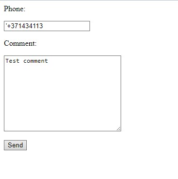
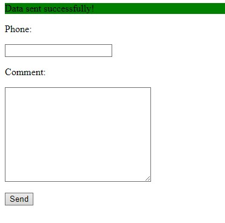
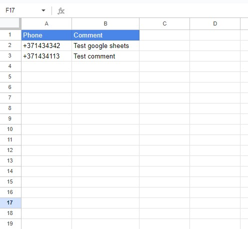

##Laravel 10
##PHP 8.1

#### Google Sheets API v4 for Laravel
[Link](https://github.com/kawax/laravel-google-sheets)

##app\Http\Controllers\TestController.php
##app\Http\Requests\TestRequest.php

## Result

